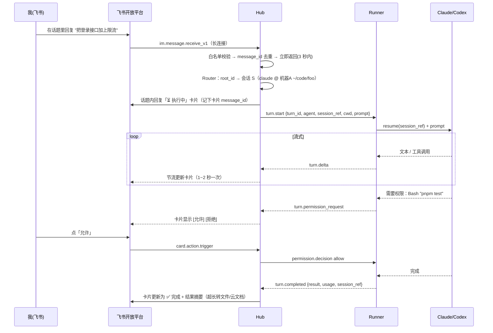

# 飞书 × 多 AI 中枢（AI Hub）方案设计

> 目标：用飞书当统一的"遥控器 + 记录本"。在飞书里发的消息由中间服务分派给 Claude / Codex / 其他 AI 执行，结果回到飞书；在电脑上直接跟 AI 聊的内容，也同步到飞书。
>
> 本地单机版实现：[`feishu-bridge/`](../feishu-bridge/)（Hub 与 Runner 合在一个进程里，接口已按本文拆分）。

---

## 1. 场景与边界

| 场景 | 描述 |
| --- | --- |
| **A. 飞书下发** | 我在飞书发消息或在话题里回复 → Hub 判断交给谁 → 对应机器上的 AI 执行 → 进度和结果回到飞书 |
| **B. 本地镜像** | 我在终端里直接跟 Claude Code / Codex 聊 → 每轮的提问和回答自动同步到飞书，对应到同一个话题 |
| **A+B 衔接** | 本地会话同步到飞书后，在飞书该话题里回复，就能接着这个会话继续干活（远程续聊） |

MVP 不做：多人协作权限、网页版 ChatGPT / Claude.ai 这类没有钩子的产品（后续可用浏览器扩展补）。

---

## 2. 总体架构

```
                    ┌──────────────────── 飞书 ────────────────────┐
                    │  话题群「AI 工作台」：一个话题 = 一个 AI 会话      │
                    │  卡片：执行中 / 完成 / 失败 / [停止] [允许] [拒绝] │
                    └───────────────▲──────────────────┬──────────┘
                   OpenAPI 发消息/更新卡片 │                  │ 长连接(WebSocket) 收事件
                    ┌───────────────┴──────────────────▼──────────┐
                    │                 Hub（中间服务，单实例）            │
                    │  Feishu Gateway  ─ 收事件/鉴权/去重/发消息/限流     │
                    │  Router          ─ 判断「由谁执行」                │
                    │  Session Registry─ 会话 ↔ 飞书话题 ↔ Runner       │
                    │  Turn Queue      ─ 每个会话串行执行、可取消          │
                    │  Store (SQLite)  ─ 会话/消息/任务/审计              │
                    └───────▲─────────────────────────▲─────────────┘
               WSS（Runner 主动连出） │                         │ WSS
       ┌─────────────────────────┴────────┐   ┌────────────┴─────────────┐
       │ Runner @ 机器 A（常驻守护进程）       │   │ Runner @ 机器 B             │
       │  ├─ Claude 适配器 (Agent SDK / -p)  │   │  ├─ Codex 适配器 (Codex SDK)  │
       │  ├─ Codex 适配器                    │   │  └─ 其他 AI 适配器            │
       │  ├─ 本地上报接口 127.0.0.1:7788      │   │                             │
       │  └─ Outbox（Hub 离线时暂存重发）      │   │                             │
       └───────▲──────────────▲────────────┘   └─────────────────────────────┘
               │ 驱动执行        │ hooks / notify 上报（场景 B）
        ┌──────┴──────┐  ┌─────┴──────────────────────────┐
        │ Claude Code │  │ 终端里直接使用的 Claude Code / Codex │
        │ Codex CLI   │  └────────────────────────────────┘
        └─────────────┘
```

三个组件：

1. **Hub（中间服务）**：唯一连飞书的进程。飞书长连接是"集群模式"，同一应用起多个客户端时每条事件只随机投给其中一个，所以**必须由单一 Hub 统一收发**，各机器不能各自直连飞书。
2. **Runner（执行端）**：每台要跑 AI 的机器一个常驻进程，**主动连出**到 Hub（机器不用暴露端口），负责驱动 AI、回传流式事件，并接收本机 hooks 的上报。
3. **Reporter（上报钩子）**：挂在 Claude Code hooks / Codex notify 上的轻量配置，把本地聊天推给本机 Runner。

只有一台电脑时，Hub 和 Runner 可以放在同一个进程里；飞书长连接不需要公网 IP。

---

## 3. 核心概念与数据模型

**核心约定：一个 AI 会话 = 一个飞书话题。** 路由、续聊、历史记录都基于这个映射。

```sql
runners   (id, name, agents_json, projects_json, status, last_heartbeat_at)
sessions  (id, agent, runner_id, project, cwd,
           agent_session_ref,          -- Claude session_id / Codex thread_id
           feishu_chat_id, feishu_root_message_id,
           origin,                     -- feishu | local
           live_in_terminal,           -- 终端里是否正开着（SessionStart/End 维护）
           status, created_at, updated_at)
turns     (id, session_id, prompt, origin, status,  -- queued|running|waiting_approval|done|failed|cancelled
           status_card_message_id, result_summary, usage_json,
           started_at, finished_at)
messages  (id, session_id, turn_id, direction, role, content,
           feishu_message_id, dedup_key UNIQUE, created_at)
approvals (id, turn_id, tool_name, input_preview, decision, decided_at)
```

`dedup_key` 用于去重：飞书事件用 `message_id`，本地上报用 `agent + session_ref + turn_id/prompt 哈希`。

---

## 4. 场景 A：飞书 → AI → 飞书



要点：

- **3 秒内确认**：长连接事件要在 3 秒内处理完，Hub 收到后只做校验、去重、入队，其余异步处理。
- **每个会话串行**：同一会话上一轮没结束，新消息排队；卡片上提示"已排队（前面还有 1 个）"。
- **Runner 离线**：任务保留在队列，飞书提示"机器A 离线，上线后自动执行 / 点此取消"。

---

## 5. 路由：区分"由谁来执行"

按优先级依次匹配，命中即停：

| # | 规则 | 例子 |
| --- | --- | --- |
| 1 | **卡片按钮回调** → 对应的 turn / 审批 | 点「停止」「允许」 |
| 2 | **话题内回复** → 话题绑定的会话（按 `root_id` 查） | 在 Claude 会话的话题里回复，就继续这个会话 |
| 3 | **显式指令** → 新建会话 | `/claude foo 修一下 CI`、`/codex api 写单测`、`@codex ...` |
| 4 | **群绑定** → 某个群固定绑定 agent + 项目 | 「前端项目群」默认 Codex + `~/code/web` |
| 5 | **粘性** → 私聊中沿用上一次的会话 | 私聊连续发消息 |
| 6 | **默认 agent** | 配置里的 `default_agent: claude` |

不建议 MVP 用 LLM 自动判断交给谁：结果不可预测，出错代价是"在错的机器错的目录执行了代码"。可以作为第 7 级兜底，并且要先弹卡片确认。

指令集（MVP）：

```
/claude [项目别名] <内容>     新建 Claude 会话
/codex  [项目别名] <内容>     新建 Codex 会话
/ls                          列出活跃会话（卡片，可点击跳转话题）
/stop                        停止当前话题正在跑的任务
/status                      各 Runner 在线状态、队列长度
/projects                    列出可用的项目别名
```

**项目别名**：Runner 配置里写死 `foo → 机器A:~/code/foo`，飞书里只能用别名，不能传任意路径（安全边界，见 §10）。

---

## 6. 场景 B：本地直接聊天 → 飞书

### 6.1 Claude Code：hooks

用到的 hook 事件与字段（均带公共字段 `session_id`、`transcript_path`、`cwd`）：

| 事件 | 关键字段 | Hub 动作 |
| --- | --- | --- |
| `SessionStart` | `session_start_reason` | 建会话，在飞书开新话题「🖥 Claude · 机器A · ~/code/foo」；标记 `live_in_terminal=1` |
| `UserPromptSubmit` | `prompt` | 话题里发「👤 …」 |
| `Stop` | `last_assistant_message` | 话题里发「🤖 …」 |
| `Notification` | `notification_type`（如 `permission_prompt`、`idle_prompt`） | 发「⚠️ 终端在等你确认」提醒 |
| `SessionEnd` | `session_end_reason` | 标记 `live_in_terminal=0`，话题标注已结束 |

`~/.claude/settings.json`（HTTP hook 直接打到本机 Runner，Runner 负责暂存和转发）：

```json
{
  "hooks": {
    "SessionStart":     [{ "hooks": [{ "type": "http", "url": "http://127.0.0.1:7788/ingest/claude", "timeout": 3,
                                        "headers": { "X-AI-Hub-Origin": "$AI_HUB_ORIGIN" },
                                        "allowedEnvVars": ["AI_HUB_ORIGIN"] }] }],
    "UserPromptSubmit": [{ "hooks": [{ "type": "http", "url": "http://127.0.0.1:7788/ingest/claude", "timeout": 3,
                                        "headers": { "X-AI-Hub-Origin": "$AI_HUB_ORIGIN" },
                                        "allowedEnvVars": ["AI_HUB_ORIGIN"] }] }],
    "Stop":             [{ "hooks": [{ "type": "http", "url": "http://127.0.0.1:7788/ingest/claude", "timeout": 3,
                                        "headers": { "X-AI-Hub-Origin": "$AI_HUB_ORIGIN" },
                                        "allowedEnvVars": ["AI_HUB_ORIGIN"] }] }],
    "Notification":     [{ "hooks": [{ "type": "http", "url": "http://127.0.0.1:7788/ingest/claude", "timeout": 3 }] }],
    "SessionEnd":       [{ "hooks": [{ "type": "http", "url": "http://127.0.0.1:7788/ingest/claude", "timeout": 3 }] }]
  }
}
```

Runner 的 ingest 接口必须**立刻返回 2xx 空响应**（`UserPromptSubmit` 的响应体可以用来拦截提问，别误返回决策字段），然后本地落盘、异步转发给 Hub。Hub 或网络挂了也不能拖慢或阻断终端里的 AI。

### 6.2 Codex：notify

`~/.codex/config.toml`：

```toml
notify = ["ai-hub-report", "codex"]
```

Codex 每轮结束时调用该程序，传入一个 JSON 参数，`type` 为 `agent-turn-complete`，带 `thread-id`、`turn-id`、`cwd`、`input-messages`、`last-assistant-message`。一次事件同时包含提问和回答，按 `thread-id` 找到或新建话题后发两条消息。`ai-hub-report` 是个小 CLI，把参数 POST 给本机 Runner。

新版 Codex 也有 hooks 机制，事件粒度更细；以官方文档为准，稳定后可替换 notify。

### 6.3 防止回环（重要）

场景 A 里由 Runner 驱动的执行，也会触发本地 hooks，不处理的话飞书会收到重复消息。两层防护：

1. **来源标记**：Runner 启动 AI 时注入环境变量 `AI_HUB_ORIGIN=hub:<turn_id>`，hook 通过 header 带回，Hub 看到就只更新状态、不重复发消息。
2. **Hub 侧去重兜底**：某会话有 Runner 正在执行的 turn 时，同一 `session_ref` 的上报按 `dedup_key` 合并。

---

## 7. 执行端：Runner 怎么驱动各个 AI

统一适配器接口：

```ts
interface AgentAdapter {
  name: string; // 'claude' | 'codex' | ...
  runTurn(req: {
    sessionRef?: string;          // 为空 = 新会话
    cwd: string;
    prompt: string;
    images?: string[];            // 飞书图片下载到本地后的路径
    env: Record<string, string>;  // 含 AI_HUB_ORIGIN
  }, sink: {
    delta(text: string): void;
    tool(event: { name: string; summary: string }): void;
    askPermission(req: { tool: string; preview: string }): Promise<'allow' | 'deny'>;
  }, signal: AbortSignal): Promise<{ sessionRef: string; result: string; usage?: unknown }>;
}
```

### 7.1 Claude Code

| 方式 | 做法 | 适用 |
| --- | --- | --- |
| **① 无头续聊（MVP 推荐）** | Claude Agent SDK `query({ prompt, options: { resume, cwd, canUseTool, permissionMode } })`，流式拿消息；`canUseTool` 回调转成飞书审批卡片。CLI 等价：`claude -p "<prompt>" --resume <id> --output-format stream-json --verbose` | 会话当前**没**在终端里开着 |
| **② 注入正在运行的终端会话** | 写一个飞书 Channel（MCP server）：声明 `claude/channel` 能力，用 `notifications/claude/channel` 推消息进会话，提供 `reply` 工具回消息；声明 `claude/channel/permission` 就能把终端的权限弹窗转到飞书，回复 `yes <id>` / `no <id>` 审批。Channel server 连 Hub，不直连飞书 | 终端里正开着、希望直接往里塞消息 |

冲突处理：Hub 通过 `SessionStart/SessionEnd` 知道会话是否在终端里开着。
- 没开着 → 用 ① resume。
- 开着且挂了 Channel → 用 ② 注入。
- 开着但没 Channel → 飞书提示"终端正在使用该会话"，给出 [复制为新会话继续]（fork）按钮，避免两个进程同时写同一会话。

Channels 目前是 research preview：协议可能变，自定义 channel 要用 `--dangerously-load-development-channels server:feishu` 启动，Team/Enterprise 组织还要管理员开启。所以放在后期做，主路径靠 ①。

### 7.2 Codex

`@openai/codex-sdk`：`codex.startThread({ workingDirectory })` / `codex.resumeThread(threadId)`，`thread.runStreamed(prompt)` 得到流式事件（`item.completed`、`turn.completed` 等）。CLI 等价：`codex exec --json "<prompt>"`，续聊用 `codex exec resume <SESSION_ID> "<prompt>"`。

无头执行没法在终端交互审批，所以要预先定好沙箱和审批策略（建议 `workspace-write` 沙箱 + 禁止网络，按项目放开）。

### 7.3 其他 AI

- 有 CLI + 无头模式的（如 Gemini CLI 等）：写一个适配器，套用同一个接口。
- 有 hooks / notify 的：复用 Reporter 做场景 B。
- 纯 API 模型（只聊天不改代码）：Hub 内置一个"API 适配器"直接调用，不需要 Runner。

---

## 8. 飞书侧设计

**应用配置**
- 企业自建应用，开启机器人能力。
- 事件订阅方式选**长连接**（无需公网回调地址）；订阅 `im.message.receive_v1`；回调订阅 `card.action.trigger`（卡片按钮）。
- 权限：接收/发送单聊和群聊消息、以应用身份发消息、读取消息中的资源（图片/文件）；要做流式卡片再加 CardKit 相关权限。

**会话载体**：建一个只有你和机器人的**话题群**「AI 工作台」，每个会话是一个话题。
- 新会话：机器人发根消息（会话信息卡片），之后都用"回复消息"接口，设 `reply_in_thread: true`，落在同一话题。
- 收到消息时根据 `root_id` / `thread_id` 反查会话。
- 私聊机器人用于发指令（`/ls`、`/status`）和快速新建任务。

**卡片**
- 状态卡片：蓝色执行中、绿色完成、红色失败、黄色等待审批；按钮 [停止] [允许] [拒绝] [在新会话继续]。
- 需要反复更新的卡片要设为可更新的共享卡片（`update_multi: true`），用"更新消息"接口 PATCH；或者直接用 CardKit 流式卡片。
- 长输出：卡片里只放摘要 + 最后 N 行，全文作为文件上传或写进云文档后附链接。

**限流**：Outbox 按会话合并更新（流式 1–2 秒一次），遇到频控错误就指数退避重试，保证同一话题内消息有序。

---

## 9. Hub ↔ Runner 协议

WebSocket + JSON，每条消息带 `id`、`type`、`ts`。至少一次投递 + 按 `turn_id` / `id` 幂等。

```
Runner → Hub
  hello            {runner_id, token, agents[], projects[], version}
  heartbeat        {running_turns[]}
  turn.started     {turn_id, session_ref}
  turn.delta       {turn_id, kind: text|tool, payload}
  turn.permission_request {turn_id, request_id, tool, preview}
  turn.completed   {turn_id, session_ref, result, usage}
  turn.failed      {turn_id, error}
  local.event      {agent, event, session_ref, cwd, data, origin}   // 场景 B 上报
  ack              {id}

Hub → Runner
  turn.start       {turn_id, agent, session_ref?, project, prompt, images[], origin}
  turn.cancel      {turn_id}
  permission.decision {turn_id, request_id, behavior: allow|deny}
  ack              {id}
```

Runner 断线后指数退避重连；重连时在 `hello` / `heartbeat` 里报告仍在跑的 turn，Hub 重发未确认的指令。

---

## 10. 安全（这套东西本质是"用飞书消息在你电脑上执行代码"）

1. **发送者白名单**：只接受你的 `open_id` 和指定的 chat，其他消息静默丢弃。
2. **项目白名单**：只能用 Runner 配置里的项目别名，不接受任意路径；每个项目单独配置权限模式。
3. **默认不开 bypass**：写文件、执行命令走飞书审批卡片；按项目逐步放开（如 `acceptEdits`）。
4. **传输**：Runner → Hub 走 WSS + 每台 Runner 独立 token；跨网络优先用 Tailscale / WireGuard，别把 Hub 端口直接暴露到公网。本地上报接口只监听 `127.0.0.1`。
5. **密钥**：飞书 `app_secret`、Runner token 放环境变量或系统钥匙串，不进仓库、不写日志。
6. **出站脱敏**：发往飞书的内容先过一遍密钥正则（API key、token、私钥块），命中就打码。
7. **审计**：每个 turn 的来源、执行机器、目录、审批记录全部落库。

---

## 11. 技术选型

**推荐 TypeScript / Node 20+**：飞书（`@larksuiteoapi/node-sdk`，自带长连接 WSClient）、Claude（`@anthropic-ai/claude-agent-sdk`）、Codex（`@openai/codex-sdk`）三方都有官方 TS SDK，一门语言全覆盖。

| 模块 | 选型 |
| --- | --- |
| Hub ↔ Runner | `ws` + `zod` 定义协议类型（shared 包里前后端共用） |
| 存储 | SQLite（`better-sqlite3` + drizzle），单机够用 |
| 进程守护 | macOS `launchd` / Linux `systemd` / `pm2` |
| 组网 | 单机：Hub+Runner 同进程；多机：Hub 放常开的机器（NAS / 小 VPS），Runner 通过 Tailscale 连入 |

建议的仓库结构：

```
apps/
  hub/                 # 飞书网关、路由、会话、队列、存储
  runner/              # 适配器、本地 ingest、outbox
packages/
  shared/              # 协议类型(zod)、工具函数
  adapter-claude/
  adapter-codex/
  reporter/            # ai-hub-report CLI（Codex notify 用）
  claude-channel-feishu/   # 后期：Claude Code Channel
config/
  hub.example.yaml     # 飞书凭据引用、白名单、默认 agent
  runner.example.yaml  # 项目别名、每个项目的权限策略
```

---

## 12. 分期计划

| 阶段 | 内容 | 验收标准 |
| --- | --- | --- |
| **M0 打通** | 飞书长连接收发、白名单、Claude 无头执行、话题 ↔ 会话绑定、结果回写（Hub+Runner 同进程） | 飞书发 `/claude foo 列一下目录`，话题里拿到结果；在话题里回复能续聊 |
| **M1 双向同步** | Claude hooks 上报、Codex notify 上报、防回环、`/ls` `/stop` `/status` | 终端里聊天，飞书同步出现且不重复；在飞书话题回复能接着本地会话继续 |
| **M2 体验** | 流式卡片、权限审批卡片、Codex 执行端、图片/文件、长输出转文档 | 需要执行命令时飞书弹审批，点允许后继续 |
| **M3 进阶** | 多机 Runner、Claude Channel 注入正在运行的终端会话、更多 AI 适配、网页面板（历史/用量统计） | 两台机器的任务在同一个飞书群里分派和查看 |

---

## 13. 风险与待确认

**风险**
- Claude Code Channels 是 research preview，协议可能变，所以只作为增强，不作为主路径。
- 同一会话被终端和飞书同时操作会写乱，按 §7.1 的冲突策略处理。
- 飞书频控、卡片大小有上限，靠 Outbox 合并更新 + 长文转文件。
- 本地会话全量同步可能刷屏，需要"按项目开关同步"或"只同步结果"的配置。

**需要你确认**
1. 执行端有几台机器？Hub 放在哪（本机 / NAS / VPS）？
2. 飞书用"话题群"还是"私聊"做主入口？
3. 飞书远程下发时的权限策略：全部审批 / 按项目放开编辑 / 只读？
4. "其他 AI"具体指哪些？决定适配器的优先级。
5. 本地会话是全部同步，还是只同步指定项目？

---

## 参考

- Claude Code Hooks：https://code.claude.com/docs/en/hooks
- Claude Code Channels：https://code.claude.com/docs/en/channels ，自定义 Channel 参考：https://code.claude.com/docs/en/channels-reference
- Codex SDK（TypeScript）：https://github.com/openai/codex/tree/main/sdk/typescript
- 飞书接收消息事件：https://open.feishu.cn/document/server-docs/im-v1/message/events/receive
- 飞书长连接接收事件：https://open.feishu.cn/document/server-docs/event-subscription-guide/event-subscription-configure-/request-url-configuration-case
- 同类开源实现（可参考）：https://github.com/HeXiaoShu520/feishu-claude-bridge
