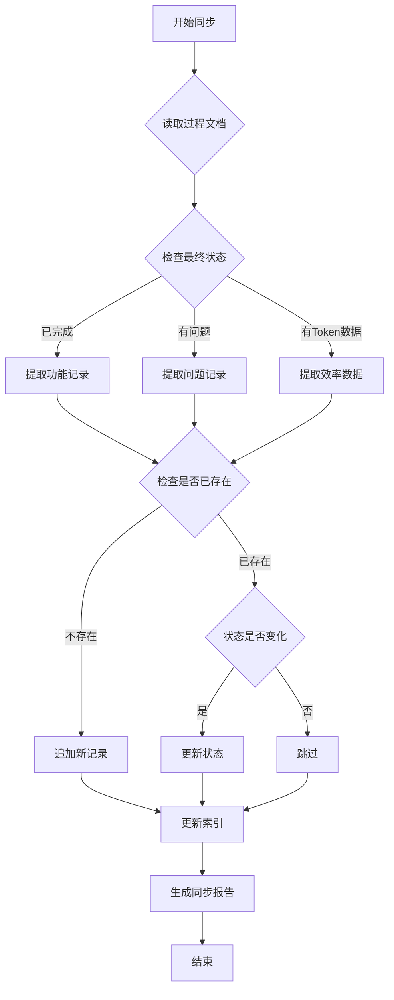

# SIRE 全局知识自动同步工具

> **用途**: 在 SIRE 工作流执行过程中，自动将收集到的经验、问题、效率数据同步到全局知识文件
> **触发方式**: 由角色8（全局知识收集师）在每个任务完成后调用
> **版本**: v1.0 (2026-07-06)

---

## 📋 功能概述

本工具提供以下核心能力：

1. **自动提取** - 从过程文档中提取关键信息
2. **智能分类** - 识别功能开发、问题解决、效率数据
3. **去重检测** - 避免重复记录相同内容
4. **增量更新** - 只添加新内容，不覆盖已有记录
5. **索引维护** - 自动更新 `global_index.json`

---

## 🔧 使用方法

### Python 脚本调用（推荐）

```python
from sire_sync import SireKnowledgeSync

# 初始化同步器
syncer = SireKnowledgeSync(global_dir="<SIRE_KB_DIR>")

# 同步单个需求的过程文档
syncer.sync_process_doc(
    project_name="driverSoftware",
    req_id="R001",
    process_doc_path="<SIRE_KB_DIR>/projects/driverSoftware/docs/R001_process.md"
)

# 批量同步所有未完成的需求
syncer.sync_all_pending(project_name="driverSoftware")

# 手动添加一条功能记录
syncer.add_feature_record({
    "date": "2026-07-06",
    "project": "driverSoftware",
    "req_id": "R010",
    "title": "新增OTA升级功能",
    "description": "...",
    "tech_stack": ["Python", "FastAPI"],
    "status": "已完成"
})
```

### PowerShell 快速同步

```powershell
# 同步当前项目的所有过程文档
.\sire_sync.ps1 -ProjectName "driverSoftware" -Mode "batch"

# 仅同步最新的一个需求
.\sire_sync.ps1 -ProjectName "driverSoftware" -Mode "latest"

# 查看待同步的文档列表
.\sire_sync.ps1 -ProjectName "driverSoftware" -Mode "list"
```

---

## 📁 目录结构

```
<SIRE_KB_DIR>/
├── sire_multi_role_workflow.md      # 工作流程定义（本工具不修改此文件）
├── sire_ai_rules.md                  # AI规则（本工具不修改此文件）
├── global_dev_features.md            # ✅ 功能开发纪要（自动更新）
├── global_problem_solutions.md       # ✅ 问题解决纪要（自动更新）
├── global_dev_efficiency.md          # ✅ 开发效率纪要（自动更新）
├── global_dev_habits.md              # ✅ 开发习惯纪要（自动更新）
├── global_index.json                 # ✅ 索引文件（自动维护）
├── projects/{项目名}/docs/           # 过程文档目录
│   ├── R001_process.md
│   ├── R002_process.md
│   └── ...
└── tools/
    └── sire_sync.py                  # 📌 本同步工具
```

---

## 🎯 同步规则

### 1. 功能开发记录 (`global_dev_features.md`)

**触发条件**:
- 过程文档中「最终状态」章节标记为「已完成」
- 且有明确的代码修改或新功能实现

**提取字段**:
```markdown
- 日期: 从过程文档第1节获取
- 项目: 从路径推断或用户指定
- 需求编号: RXXX
- 需求标题: 从第1节获取
- 需求描述: 从第1节摘要
- 验收标准: 从第1节提取 checklist
- 技术方案: 从第5节「执行信息」提取关键技术点
- 涉及模块: 从第5节提取文件路径
- 状态: 已完成 / 进行中 / 搁置
- 关键词: 从需求标题和描述中提取
```

**去重策略**:
- 检查是否已存在相同的 `需求编号`
- 如果存在且状态不同，更新状态而非新建

---

### 2. 问题解决记录 (`global_problem_solutions.md`)

**触发条件**:
- 过程文档第9节「问题记录」中有内容
- 或有 ERROR/WARN 级别的日志

**提取字段**:
```markdown
- 日期: 问题发生时间
- 项目: 同上
- 问题分类: 技术问题 / 架构设计 / 环境问题 / 其他
- 问题描述: 从错误日志提取
- 问题根因: 从问题分析提取
- 解决方案: 从解决步骤提取
- 涉及角色: 哪个角色遇到的问题
- 严重度: CRITICAL / HIGH / MEDIUM / LOW
- 状态: 已解决 / 进行中 / 未解决
- 关键词: 从错误信息和解决方案提取
- 复用次数: 初始为 0
```

**去重策略**:
- 基于问题描述的语义相似度（使用简单关键词匹配）
- 如果相似度 > 80%，提示用户是否合并

---

### 3. 开发效率记录 (`global_dev_efficiency.md`)

**触发条件**:
- 每个需求完成后自动触发

**提取字段**:
```yaml
- 日期: 完成日期
- 项目: 同上
- 任务编号: RXXX
- 阶段: 需求分析 / 开发执行 / 审查 / 测试 / 集成测试
- 指标:
    总需求数: N
    角色3完成: N
    角色4完成: N
    并行效率提升比: X%
    平均闭环迭代次数: X次/需求
    角色5审查平均耗时: X分钟
    角色6测试平均耗时: X分钟
    技术债务偿还率: X%
- Token消耗统计: 从第6节提取
- 时间预估偏差:
    预估总时间: X分钟
    实际总时间: X分钟
    偏差率: X%
    偏差标记: 预估偏高 / 预估偏低 / 准确
- 效率分析: 从第7节「最终评估」提取
- 关键词: 高效率 / 低效率 / 零Token / API调用等
```

**去重策略**:
- 每个需求编号只保留一条效率记录
- 如果重新执行，更新而非新建

---

### 4. 开发习惯记录 (`global_dev_habits.md`)

**触发条件**:
- 检测到重复性的操作模式
- 或用户明确标注的习惯

**提取字段**:
```markdown
- 日期: 首次发现日期
- 习惯名称: 简短描述
- 习惯类型: 编码风格 / 工具偏好 / 工作流程 / 沟通方式
- 详细描述: 具体表现
- 适用场景: 何时适用
- 优点: 带来的好处
- 缺点: 潜在风险
- 建议: 是否推广或改进
- 出现频率: 高频 / 中频 / 低频
- 关键词: 相关标签
```

**去重策略**:
- 基于习惯名称的精确匹配
- 相似习惯会提示合并

---

## 🔄 同步流程



---

## 📊 同步报告格式

每次同步完成后，生成如下报告：

```markdown
## 📈 SIRE 知识同步报告

**同步时间**: 2026-07-06 16:30:00  
**项目**: driverSoftware  
**同步范围**: R001-R010

### 同步结果

| 文件 | 新增记录 | 更新记录 | 跳过记录 |
|------|---------|---------|---------|
| global_dev_features.md | 3 | 1 | 6 |
| global_problem_solutions.md | 2 | 0 | 8 |
| global_dev_efficiency.md | 10 | 0 | 0 |
| global_dev_habits.md | 1 | 0 | 9 |

### 新增功能记录
- ✅ F-010: 新增OTA升级功能 (R010)
- ✅ F-011: 优化RS485通信协议 (R011)
- ✅ F-012: 重构前端Scope图表 (R012)

### 新增问题记录
- ⚠️ P-006: FastAPI依赖缺失导致启动失败
- ⚠️ P-007: hidapi包导入错误

### 效率亮点
- 🚀 R010 开发效率极高（预估30分钟，实际5分钟）
- 💡 R011 零Token消耗（直接使用工具修改）

### 建议
1. R010的时间预估模型需要调整（偏差率 -83%）
2. 建议建立依赖安装检查清单，避免P-006类问题

---
*报告由 SIRE Sync Tool v1.0 自动生成*
```

---

## ⚙️ 配置选项

创建 `<SIRE_KB_DIR>/sire_sync_config.json` 进行自定义配置：

```json
{
  "global_dir": "<SIRE_KB_DIR>",
  "auto_sync": true,
  "sync_on_complete": true,
  "dedup_threshold": 0.8,
  "log_level": "INFO",
  "backup_before_sync": true,
  "index_auto_update": true,
  "notification": {
    "enable": true,
    "show_summary": true,
    "show_details": false
  }
}
```

---

## 🛠️ 高级用法

### 1. 自定义提取规则

```python
from sire_sync import CustomExtractor

# 定义自定义提取器
extractor = CustomExtractor()

# 添加自定义规则
extractor.add_rule(
    field="custom_field",
    pattern=r"自定义正则表达式",
    section="第X节"
)

# 使用自定义提取器
syncer = SireKnowledgeSync(extractor=extractor)
```

### 2. 批量导入历史数据

```python
# 导入某个时间段的所有过程文档
syncer.import_historical_data(
    start_date="2026-01-01",
    end_date="2026-07-06",
    project_filter=["driverSoftware", "Emy"]
)
```

### 3. 导出知识库

```python
# 导出为 Markdown 合集
syncer.export_to_markdown(output_path="~/sire_knowledge_export.md")

# 导出为 JSON（用于其他系统导入）
syncer.export_to_json(output_path="~/sire_knowledge.json")
```

---

## ❓ 常见问题

### Q1: 同步后如何回滚？
A: 每次同步前会自动备份原文件到 `<SIRE_KB_DIR>/.backups/`，可通过 `--rollback` 参数恢复。

### Q2: 如何手动触发同步？
A: 运行 `python sire_sync.py --manual-sync` 或在 Qoder 中输入 `/sire sync`。

### Q3: 同步会覆盖已有内容吗？
A: 不会。采用增量追加策略，只添加新记录，不修改已有内容（除非状态变化）。

### Q4: 如何禁用自动同步？
A: 在配置文件中设置 `"auto_sync": false`，或环境变量 `SIRE_AUTO_SYNC=false`。

---

## 📝 更新日志

### v1.0 (2026-07-06)
- ✨ 初始版本发布
- ✅ 支持四大知识文件自动同步
- ✅ 智能去重检测
- ✅ 增量更新策略
- ✅ 自动生成同步报告
- ✅ 索引文件自动维护

---

*本工具由 SIRE 角色8（全局知识收集师）维护*  
*最后更新: 2026-07-06*
